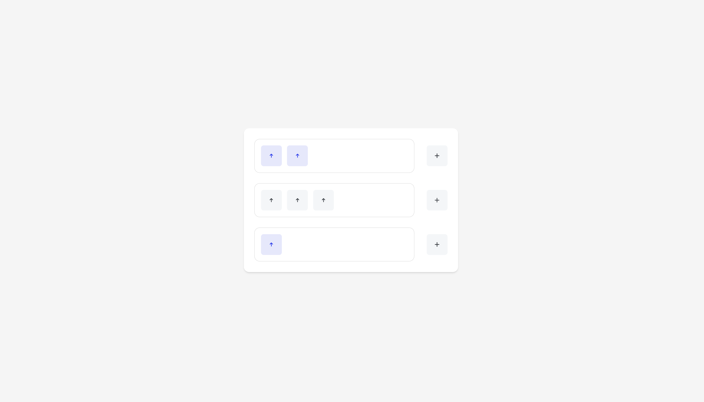

# Upvote System

A modern, interactive upvote system built with React and TypeScript. This application allows users to create multiple lists of upvotes, toggle their states, and persist the data across page refreshes.



## Features

- Create multiple upvote lists
- Toggle upvote states (selected/unselected)
- Add new upvotes to lists
- Persistent data storage
- Responsive design
- TypeScript support
- Unit tests

## Tech Stack

- **React** - UI library
- **TypeScript** - Type safety and better developer experience
- **Redux Toolkit** - State management
- **Redux Persist** - Data persistence
- **CSS Modules** - Scoped styling
- **Jest** - Testing framework
- **Testing Library** - React component testing
- **Vite** - Build tool and development server

## Installation

1. Clone the repository:
```bash
git clone <repository-url>
cd scrawlr-upvote-system
```

2. Install dependencies:
```bash
npm install
```

3. Start the development server:
```bash
npm run dev
```

4. Open [http://localhost:5173](http://localhost:5173) in your browser.

## Running in GitHub Codespaces

This project is configured to run in GitHub Codespaces, providing a consistent development environment in the cloud.

### Quick Start

1. Click the "Code" button in the repository
2. Select the "Codespaces" tab
3. Click "Create codespace on main"

The environment will be automatically configured with:
- Node.js 20
- All required VS Code extensions
- Pre-configured development settings

### Development in Codespaces

Once your codespace is ready:

1. The dependencies will be automatically installed
2. Start the development server:
```bash
npm run dev
```
3. The application will be available on port 5173
4. GitHub Codespaces will automatically forward the port to your browser

### Features

- **Pre-configured Environment**: All dependencies and tools are pre-installed
- **VS Code Integration**: Full VS Code experience in the browser
- **Port Forwarding**: Automatic port forwarding for development server
- **Git Integration**: Full Git support with your GitHub account
- **Extensions**: Pre-installed extensions for React, TypeScript, and ESLint

### Troubleshooting

If you encounter any issues:

1. **Port Already in Use**: The development server will automatically use the next available port
2. **Dependencies**: Run `npm install` if dependencies are not automatically installed
3. **VS Code Extensions**: All required extensions are pre-installed, but you can install additional ones if needed

## Available Scripts

- `npm run dev` - Start development server
- `npm run build` - Build for production
- `npm run test` - Run tests
- `npm run lint` - Run linter
- `npm run preview` - Preview production build

## Project Structure

```
src/
├── components/
│   ├── ui/           # Reusable UI components
│   └── upvote/       # Upvote-specific components
├── store/           # Redux store and slices
├── styles/          # Global styles and variables
└── App.tsx          # Root component
```

## Testing

The project includes unit tests for the upvote functionality. Run tests with:

```bash
npm test
```

### Redux DevTools

Debugging & Developer Experience
This project includes integration with Redux DevTools to make it easy to inspect state transitions and debug Redux actions. You can view dispatched actions and state history using the Redux DevTools browser extension.

## Assignment Description

This project was created as a technical assessment to demonstrate React and TypeScript skills. The requirements included:

1. Creating a reusable upvote component with two states:
   - Default state: Background #F4F6F8, Arrow #343A40
   - Selected state: Background #E5E8FD, Arrow #253CF2

2. Implementing upvote lists with the following features:
   - Toggle selection state for all upvotes in a list
   - Independent selection states between lists
   - Add new upvotes to lists
   - Persist data across page refreshes

3. Technical requirements:
   - Reusable components
   - State management
   - Data persistence
   - Unit tests
   - TypeScript implementation

